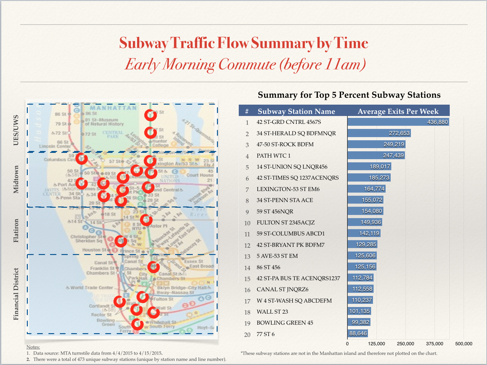

Are you a New Yorker who loves your subways?

Even if you don't, you might often be wondering - what subway stations are the busiest? How can I avoid rush hour traffic and smelly subway trains in the morning/afternoons?  Say that we have a massive outbreak of flu in NYC - or that we are running away from zombies who are waiting to attack from high traffic stations - which areas should we stay away from?

In this analysis I dug into the MTA turnstile data, and churned out a list of the highest traffic subway stations. I looked into data throughout the weeks of 4/4/2015 to 4/15/2015. You can find the data source here: http://web.mta.info/developers/turnstile.html

What I found out was that:

####In the Mornings
People are generally coming in from the outer boroughs to work. 

####During Lunch Periods

Traffic is heavily concentrated in X , Y, Z.

<insert picture>

####In the Afternoons
People are clearing out of Manhattan and heading back home. 

Traffic is heavily concentrated in X , Y, Z.

<insert picture>

####In the Evenings
Some traffic is coming from people going home on their "second shifts".  Overall traffic volume is lower. 

Traffic is heavily concentrated in X , Y, Z.

<insert picture>

So … if you are trying to stay away from crowded subway stations, avoid Midtown during rush hours! And all the other high traffic stations highlighted above. 

Happy commuting!!!
