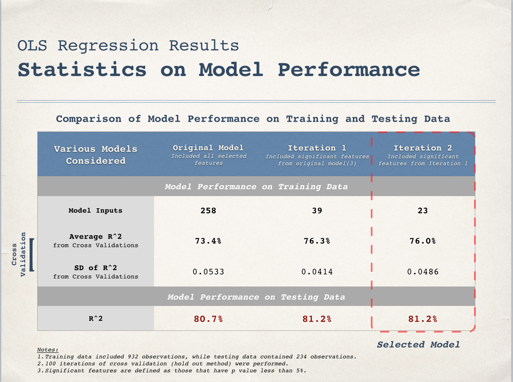
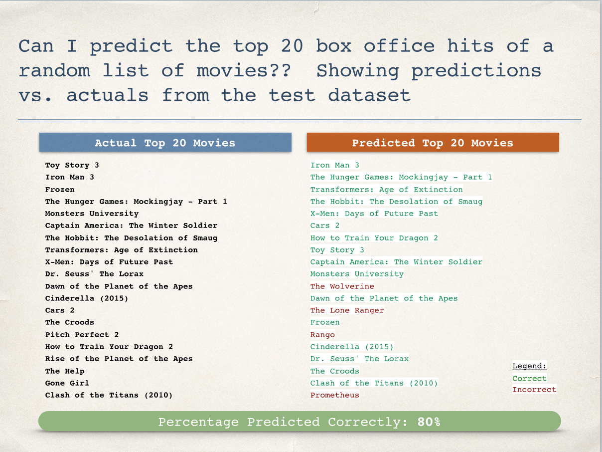

Can you predict this year's biggest box office hits in the theaters?

My husband claims that he can, just by his gut feelings.  Or simply on whether it's a superhero movie or a Disney animated film.  Especially because he thinks Disney is trying to take over the world.

I make NO such bold claims. Instead I tinker with data and try to build a predictive model -

####Background

In this analysis I scrapped 5 years of movie data (2010 - 2015) from [boxofficemojo](http://boxofficemojo.com) and [imdb] (http://www.imdb.com/). For predictive algorithm I used linear regression here.

Some researchers have accurately predicted movie box office success from analyzing consumer activity prior to a movie's release, such as wikipedia edits, Facebook/Twitter, or Google Searches. One drawback to using this approach is that you might be limited by having to collect data right before the movie release. I might look into this for a future analysis - for now I focused mostly on "inherent" movie characteristics, such as movie genre, production company, movie screens, etc.

####Feature Selection and Transformation
The features I considered included:

	1. Brand (Disney, DreamWorks, Marvel Comics, etc)
	2. Distribution Company (Fox, Buena Vista, etc)
	3. Series or Franchise (LOTR, X-Men, Hunger Games, etc.) 
	4. Genre (Action, Drama, Comedy, etc)
	5. "Star" Actor/Actress (total Oscar-Nominated casts members)
	6. "Star" Director (Oscar-Nominated director)
	7. Maximum Screens
	8. Release Date

I experimented and settled on these feature transformations which improved my model performance:

1. I combined Brand & Genre (e.g. Action - Marvel Comics, Animation-Pixar). 
2. I included higher power terms for Screens.  Maximum screens have a non-linear relationship with total box office (since movies are screened over several weeks, with each subsequent week having fewer screens or theaters showing the movie).
3. I made dummy variables for the month of movie release . A couple of months (including June, November, December) showed significant relationship with box office success. 
4. I created a "star factor" variable which combines the effect from Oscar Stars with Oscar Directors and Series/Sequels. This factor awards movies with both Oscar Stars and Oscar Director more points, and even more if it is part of a Series/Franchise. The equation was:
[Oscar Star(s) + Oscar Directors + Series + Oscar Star(s)* Series + Oscar Director * Series + Oscar Star(s) * Oscar Director]

####Model Performance
After multiple iterations I achieved these results on 3 alternative models:

At each iteration I reduced the number of model parameters by taking out variables that are not significant, and it improves the model performance both on the training set and test set - good takeaway! Having a few significant strong predictors is better than having a ton of less significant predictors. 

My final result: 81% R Squared! Not too bad for now. 

####What exactly does it all mean? Or how can I even use this?
Well for one I can show off to friends. (You might be asking - who are these "friends"? Are you sure that they are still your "friends"? ) 

I also looked into - if I were to use my model to pick the top 20 box office hits, how would it do against actual results. I used my test data to check this out and these are the results:

I got 16 out of 20 correct! Dammit Jonny Depp for making your flops.  

[Additional Information and Datasets] (https://github.com/Itelina/BoxOfficePrediction)

