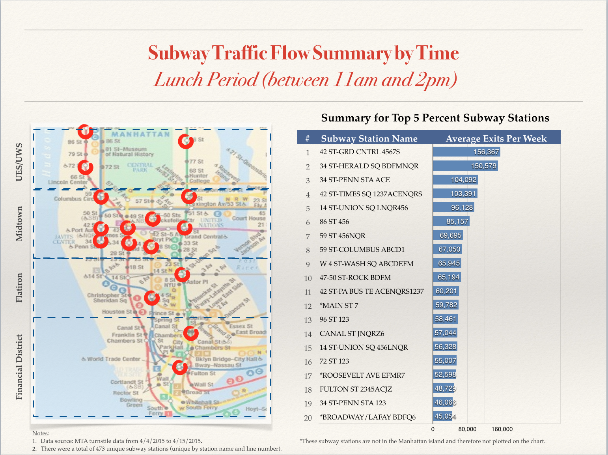
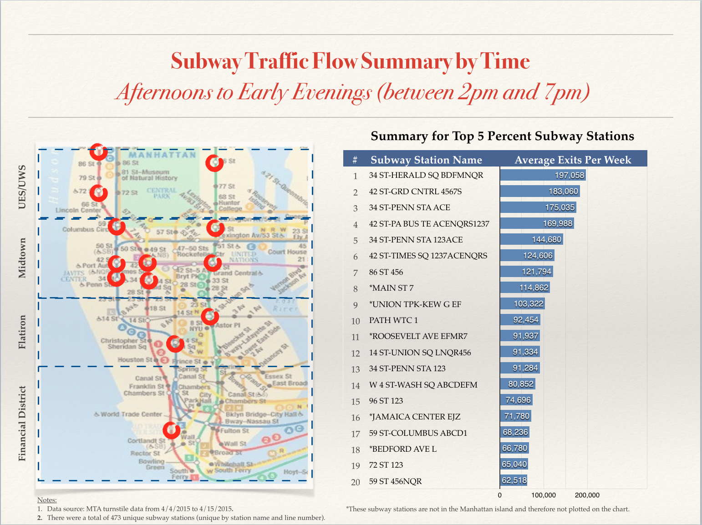

Are you a New Yorker who loves your subways?

Even if you don't, you might be wondering - which subway stations are the busiest? How can I avoid smelly subway trains in the early commute hours? 

In this analysis I dug into the MTA turnstile data for April of 2015, and churned out a list of the highest traffic subway stations. You can find the data source from MTA [here](http://web.mta.info/developers/turnstile.html). What I found out was that:

####In the Mornings
People are generally coming in from the outer boroughs to work. 

####During Lunch Periods
During lunch hours, there are some people coming into the city (probably for the "2nd" shift). Overall traffic volume is lower compared to the mornings. 

####In the Afternoons
People are clearing out of Manhattan and heading back home. 

####In the Evenings
Some traffic is coming from people going home on their "second shifts".  Overall traffic volume is lower. 

So … if you want to avoid smelly subway stations during commuting hours ... stay away from the stations above! Especially midtown. 

Happy commuting!!!
