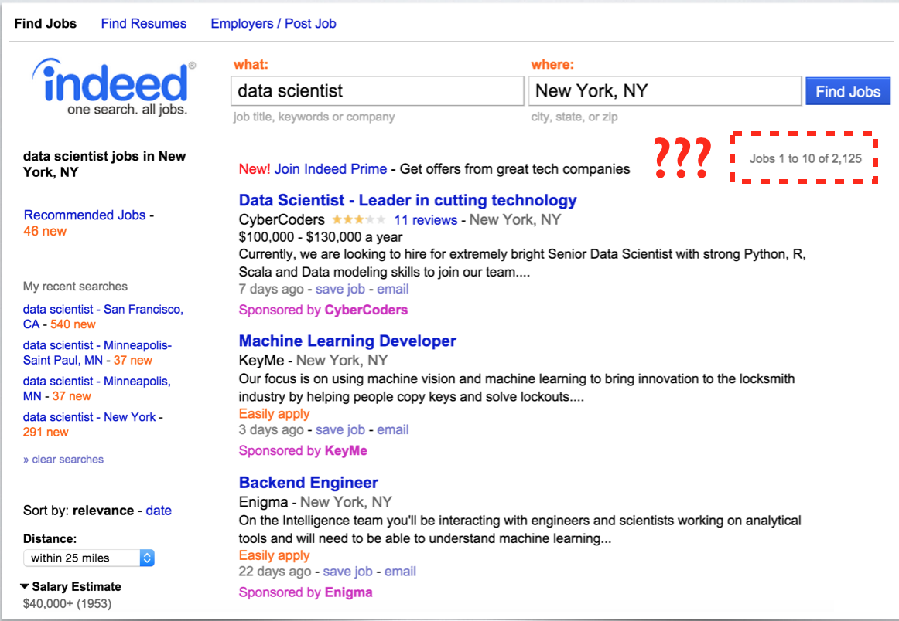
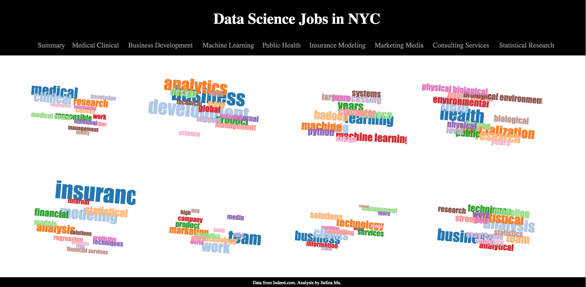

So the first time that I searched for "data scientist" jobs in NYC on indeed.com, I got 2,125 results. I read through maybe the first 200 results and gave up all together. This is too much to read!

Granted, most of the time people find jobs through their networks, but suppose that you have no such luxuries, and have to start from the common job boards, how can you pick out the ones that are the most relevant to you, from thousands of results?

This problem can be particularly notorious for data science jobs - since there is a lot of ambiguity by nature. Some data science roles may emphasize your knowledge of engineering, machine learning, while others emphasize on your business intuition, ability to ask the right questions, etc. Some companies may not be mature enough to understand what they are looking for. A [VERY good study] (http://cdn.oreillystatic.com/oreilly/radarreport/0636920029014/Analyzing_the_Analyzers.pdf) here discussing the differences in data scientist roles published by O'Reilly.

I figured that this is a ripe opportunity to do some natural language processing and topic modeling. Suppose that I look into the texts for each job posting, and analyze the prevalent "topics" through LDA topic modeling. I hypothesize that if I process the texts appropriately, the topics will point to core competency groups in data science, such as business, machine learning, programming. And each job posting with ask for particular competencies. Based on the top competencies that a job posting ask for, you as a job seeker can figure out whether a particular posting is the right fit for you, both in terms of what you can do currently and how you would like to grow as a professional.

###Data Scraping
I scraped all job postings for "data scientist" from indeed.com using their search API. The data points I collected include  job posting description, company, position. I mostly used BeautifulSoup and stored the data points I collected in MongoDB. 

###NLProcessing and Analysis
The first thing I did after scraping search results from Indeed was to exclude "irrelevant" search results - for example sometimes Indeed would return results for "scientist" positions rather than "data scientist" positions. This would reduce the overall job postings to about ~300. 

Then I used the "bag of words" approach where I kept all the nouns, gerunds, and adjectives from each job postings.

Lastly I used LDA modeling to extract the relevant topics, and then I grouped the job postings by the most relevant topics. I decided on a total of 9 topics mostly by manually reviewing the results and seeing if they made sense. 

###Visualization App
I developed an app to visualize the results! I mostly used d3, html, javascript. Check it out here (click on the image to go to the interactive app):

[] (http://jobsearchcompanion.herokuapp.com/)

I did this project in a relatively short period of time (2 weeks), and I spent a lot of time learning how to make the front end work, so I would love to improve some aspects of the analyses in the future. For example, while currently I am only considering the top "topic" for each job posting when grouping them, I would love to consider multiple topics for each job postings as a way to group them. I would also love to scale this so that the user can input any job types or cities and get the same analyses. Some day …

Happy job searching!
