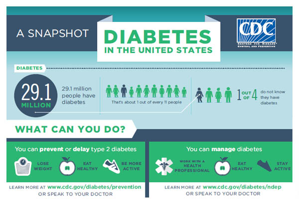
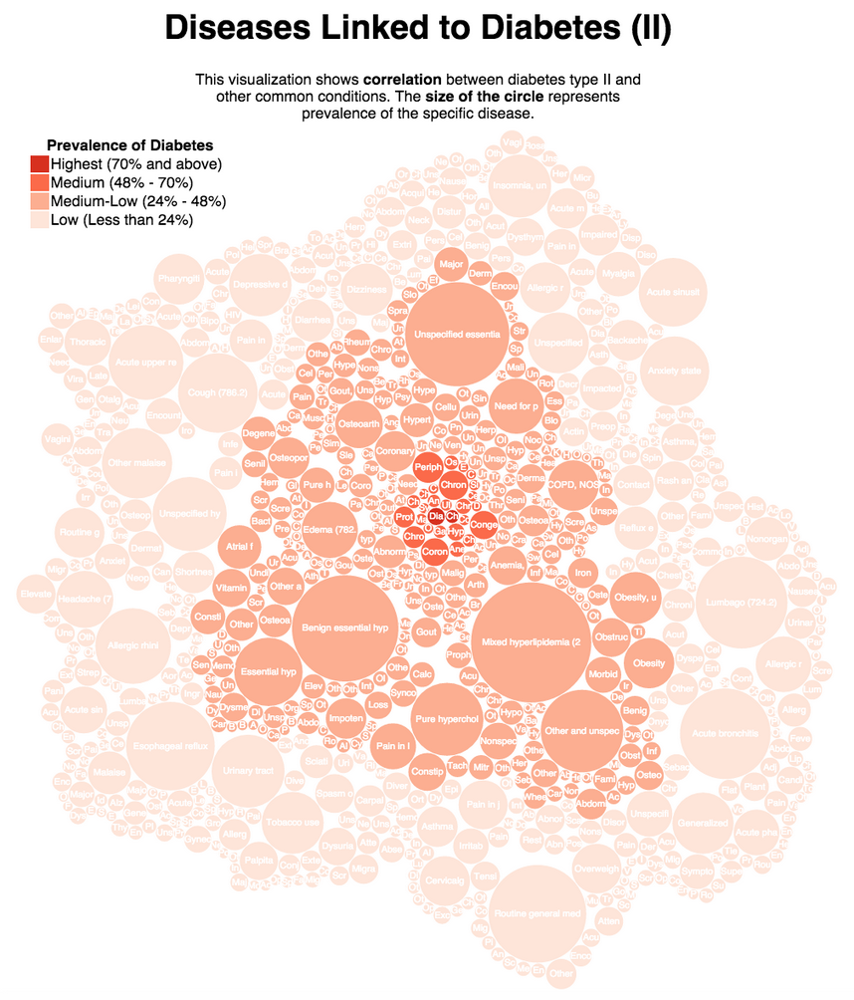
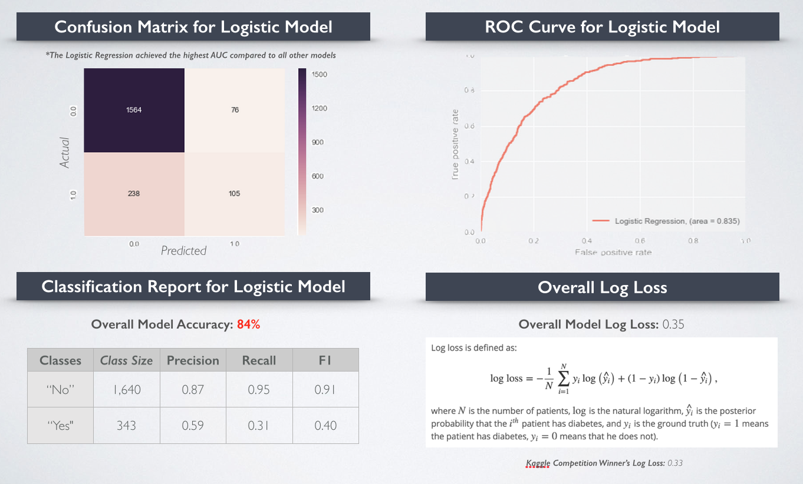

Diabetes is the 7th leading cause of death in the US. Roughly 9.3% Americans have it. Most importantly, type II diabetes often go undetected, because it is largely asymptomatic in its early stages - about 25% of people with type II diabetes don't know that they have it. 

Predicting patient's risk for diabetes can help with early disease detection and treatment. In this analysis I set out to develop a risk model for type II diabetes. I utilized a set of de-identified electronic medical records data from Practice Fusion - you can find it through this [kaggle challenge] (https://www.kaggle.com/c/pf2012-diabetes). 

###Summary of Data 
The dataset contains 5 years of medical records for approximately 9000 patients. These medical records contain a pretty comprehensive coverage of patients' history - including their ICD9 diagnoses, lab results, prescription/ drug history, blood pressure/BMI, visiting physician, allergies, smoking status, etc.

###Key Modeling Features
After much research and exploratory analysis I decided to narrow down my features to these following categories:

1. BMI (Presence of Obesity)
2. Blood Pressure 
3. Age/Gender
4. Co-existing Conditions Presenting Risk for diabetes

Visualization
[] (http://itelina.github.io/firstvisualization.html)

In my final model I included a total of 262 features. 

The final variable that I predicted was a "yes" or "no" indicator for whether a patient has type II diabetes, as defined by ICD9 codes 250, 250.0, 250.*0 or 250.*2 (e.g., 250, 250.0, 250.00, 250.10, 250.52, etc)

###Modeling Results

I considered a variety of classification algorithms - my Logistic Regression model turned out to be the best performing one in terms of AUC (area under the curve for [ROC](https://en.wikipedia.org/wiki/Receiver_operating_characteristic)). 

![alt text] (../images/diabetesresults1.png "Diabetes Results 1")

I was able to achieve a final modeling accuracy of 84% for predicting whether or not a patient has diabetes based on their past 5 years of medical activity records. In real life implementation, I would favor moving toward the right side of the ROC curve, as I would rather have more false alarms in exchange for identifying more people that truly have the disease (higher false positive and higher true positive rates through setting lower thresholds). My model's final [log-loss rate] (http://www.quora.com/What-is-an-intuitive-explanation-for-the-log-loss-function) was 0.35, compared against the Kaggle challenge winnter's 0.33.

Now that we understand what causes diabetes ... time to exercise??? *cue to nag husband :)
