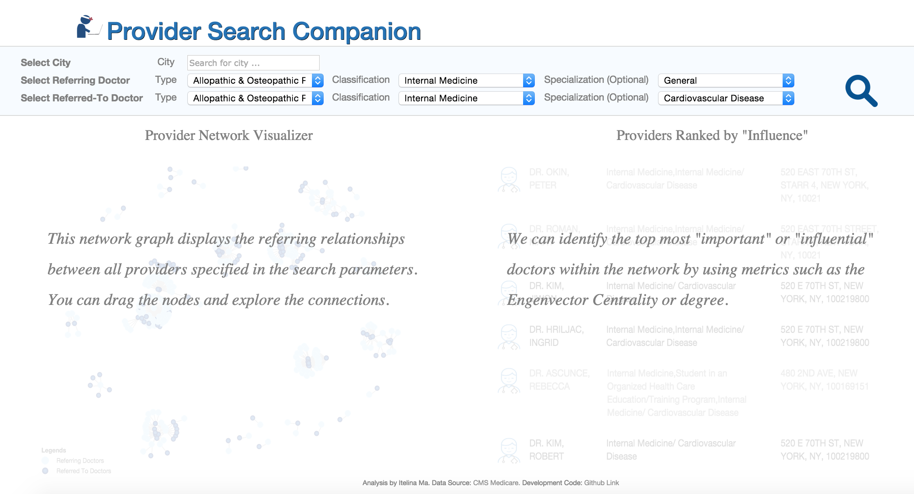

Generally, finding a "good", reputable doctor can be difficult. We have many resources out there - insurance websites or Zocdoc etc - but rarely do these resources provide reliable information on the quality of care, experience, or even outcome from potential providers. Are there creative ways that we can provide more transparency? Are there public data sources that can help us with that?

Several years ago CMS began publishing a dataset on physician referrals. The dataset contain information for each referring, referred to doctor, and the actual volume of referrals as seen through their medical claims. Using the NPI numbers provided, you can also piece it together with other information on providers, such as their specialty, location, etc. This dataset presents a rich opportunity to analyze the network relationships between physicians.

My goal for this project was to identify and rank the most "influential" doctors, within a specified referring relationship. For example, if I want to look for options in finding a cardiologist, can I find out who is the most influential, based on primary care providers,  through centrality measures? Aka according to primary care doctors, which specialist do they like to refer most of their patients to? 

Now referral patterns/decisions can be driven by many factors - such as a doctor's personal network, previous experience, etc. In continuing analyses I would delve into this more, identify what some of these factors are, how they contribute to referrals, and potentially how we could get a more "pure" view of referrals driven primary due to quality of care/patient experience etc. For this analysis I developed an app to visualize the network relationships, and the top ranking doctors by the Eigenvector Centrality measure (click on the image below to be taken to the app).

[] (http://ec2-52-20-33-40.compute-1.amazonaws.com/)

To illustrate an example search: suppose that you want to visualize the network relationships between primary care doctors and cardiologists in NYC:

1. Type in New York, NY for city
2. Select referring doctor as "Allopathic etc", "Internal Medicine", "General" (this classification refers to primary care doctors)
3. Select referred to doctor as "Allopathic etc", "Internal Medicine", "Cardiovascular Disease" 
4. Click "search" icon

####Data Sources
1. [Physician Referral Data](https://questions.cms.gov/faq.php?faqId=7977)	
2. [Physician NPI Data](https://www.cms.gov/Regulations-and-Guidance/HIPAA-Administrative-Simplification/NationalProvIdentStand/DataDissemination.html)
3. [Physician Medicare Data](https://www.cms.gov/Research-Statistics-Data-and-Systems/Statistics-Trends-and-Reports/Medicare-Provider-Charge-Data/Physician-and-Other-Supplier2013.html)
4. [Physician Taxonomy Codes](http://www.nucc.org/index.php?option=com_content&view=article&id=107&Itemid=132)
5. [Taxonomy Crosswalk](https://www.cms.gov/Medicare/Provider-Enrollment-and-Certification/MedicareProviderSupEnroll/Downloads/TaxonomyCrosswalk.pdf)
	
